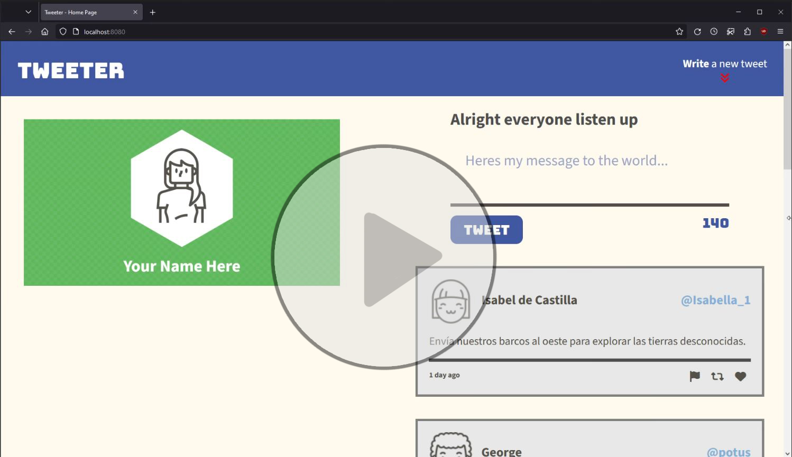
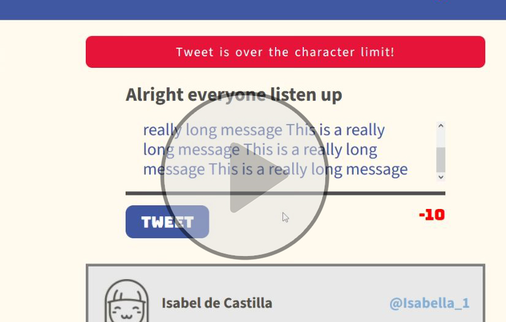
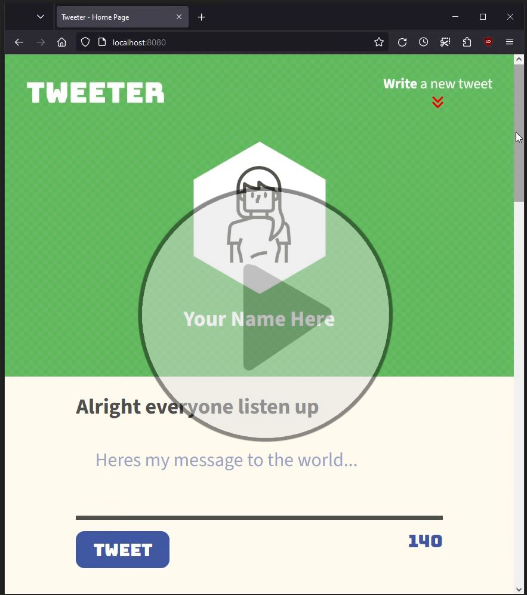

# Tweeter Project 

Tweeter is a basic single page app, meant to be a clone of Twitter. 💬

Initial code was forked from starter code from Lighthouse Labs. This was an excellent challenge for sharpening my experience in the frontend workflow (HTML, CSS, Javascript) as well Express, jQuery and AJAX~.

## Running Tweeter

1. [Create](https://docs.github.com/en/repositories/creating-and-managing-repositories/creating-a-repository-from-a-template) a new repository using this repository as a template.
2. Clone your repository onto your local device.
3. Install dependencies using the `npm install` command.
3. Start the web server using the `npm run local` command. The app will be served at <http://localhost:8080/>.
4. Go to <http://localhost:8080/> in your browser.

## Dependencies
Requires these modules at Minimum:

- Express v 4.13.4
- Node v 5.10.x
- Chance v 1.0.2
- Body-parser v1.15.2
- MD5 v 2.1.0
  

# Preview Tweeter In Action 
Below are a few clips to demonstrate how Tweeter looks and behaves for an end user. Click to see each segment being showcased.

### Reactive Breakpoints Demo Clip

### Message Submission Video

### Mobile Layout Video Demo

<!-- 

 
-->